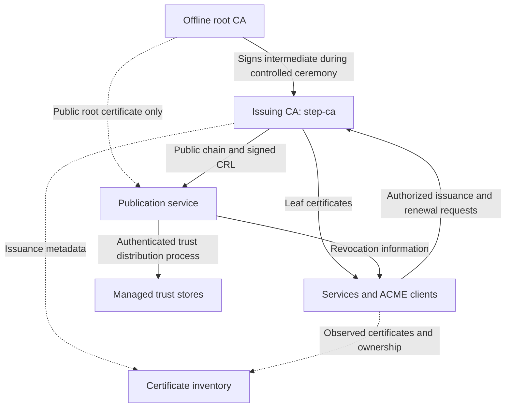
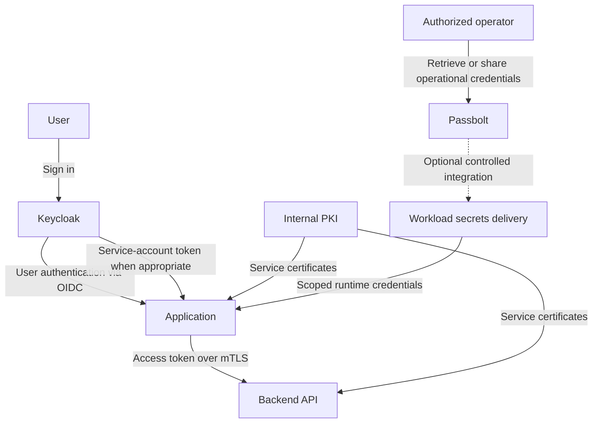
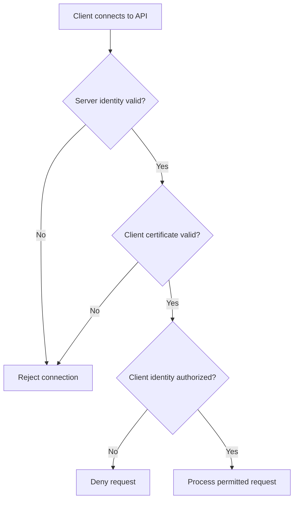

# Internal PKI and Machine Identity
## step-ca · ACME · mTLS · Certificate Inventory

I designed and implemented the internal PKI myself, including the CA hierarchy and ACME issuance and renewal work. Here I explain the design in my own terms: where I would draw the trust boundaries, how I would manage certificates beyond issuance, and how the pieces fit into a wider identity architecture.

**Scope:** The examples are independent and use fictional names. They disclose no employer or customer environment, private keys, internal configurations, or production measurements. Renewal automation and mTLS are described as architectural workflows, not as claims of deployment in this example.

## The design question

How can an organization give its services verifiable identities, replace certificates reliably, and understand where cryptography must change?

A certificate authority addresses issuance. A complete operating model also needs ownership, renewal, trust distribution, revocation handling, inventory, and application authorization.

## Reference architecture

Arrows show responsibilities and information flow, not permanent network connections. The root stays offline during routine issuance. Private CA keys never belong on the publication service or in the inventory.

| Component | Responsibility | Design consideration |
|---|---|---|
| Offline root CA | Establish the trust anchor and sign issuing-CA certificates | Controlled access, protected backups, documented signing ceremonies |
| Issuing CA | Issue leaf certificates under defined identity policies | Restricted administration, protected signing key, recoverable state |
| Publication service | Distribute public CA certificates and signed CRLs | No CA private keys; monitor availability and freshness |
| Workloads | Hold their own keys, request certificates, and use identities | Restrict key access and plan certificate replacement |
| Trust distribution | Install approved trust anchors in operating systems and application stores | Verify fingerprints through a trusted channel and support rollover |
| Inventory | Associate certificates with services, owners, and dependencies | Reconcile CA records with what endpoints actually serve |

Separate the root, issuing, and publication roles to limit key exposure. This logical separation does not itself provide high availability: issuance continuity, publication redundancy, database recovery, and trust-store distribution each need their own operating procedures. See Smallstep's [production considerations](https://smallstep.com/docs/step-ca/certificate-authority-server-production/).

## How PKI fits into the identity and secrets architecture

PKI, user identity, application identity, and secrets management address different parts of the same access model. The following integration design keeps those responsibilities explicit.

| Component | Responsibility | Boundary |
|---|---|---|
| **Internal PKI / step-ca** | Issue certificates for machines and services; support TLS and mTLS | Certificate authentication still requires an authorization policy |
| **Keycloak** | User SSO and MFA; OIDC/SAML application integration; service-account tokens for applications acting on their own behalf | Applications and APIs must validate tokens and enforce permissions |
| **Passbolt** | Controlled storage and sharing of operational passwords and secrets; integration through supported APIs and tooling | Target-system rotation and workload delivery require explicit integration |
| **Workload secrets management** | Deliver application credentials and manage their replacement or expiry | Dynamic credentials, leases, and automatic rotation depend on the selected backend and integration |
| **Certificate inventory** | Track certificate owners, algorithms, expiry, and dependencies | Store metadata and references, never private keys or secret values |

Keycloak supports standards-based application integration and service accounts. See its [application security overview](https://www.keycloak.org/securing-apps/overview) and [documentation](https://www.keycloak.org/documentation). Passbolt provides credential sharing and API/CLI integration; verify capabilities against the selected edition and release. See [Passbolt's product overview](https://www.passbolt.com/).

### Logical integration

These are logical relationships, not a claim of an already deployed integration. The workload-secrets component represents a capability, not a requirement to buy another product. The dotted connection represents an optional integration that must define workload authentication, access policy, and credential handling.

### One request, several checks

1. A user signs in through Keycloak using the configured authentication policy.
2. The application uses the appropriate OIDC flow for user authentication and obtains an access token for the intended API. An unattended service can instead use an appropriately scoped service account.
3. The application connects to the backend over mTLS, establishing the identities of the communicating services.
4. The API validates the access token's signature, issuer, audience, and lifetime, then enforces the required scopes or roles.
5. Where both checks are required, the API also enforces the intended relationship between the calling service and the token context.

An ID token is not a substitute for an API access token. Likewise, carrying a bearer token over mTLS does not automatically bind that token to the client certificate; sender-constrained tokens require explicit protocol support and configuration.

### Secrets lifecycle and access boundaries

Use Passbolt for controlled operational credential access and supported automation integrations. For runtime secrets, define how the workload authenticates, which secrets it can retrieve, how delivery avoids logs and source control, and how the consuming application adopts replacements.

Updating a stored password is not the same as rotating it in the target database or service. A complete rotation workflow changes the target credential, updates the consumer, verifies access, and retires the old credential safely. Short-lived dynamic credentials require a backend that can issue and revoke them.

Keep CA signing keys under dedicated key-protection procedures rather than treating them as ordinary shared operational secrets. Define independent emergency access and recovery procedures so an identity-provider outage does not lock operators out of recovering the identity and secrets services themselves.

## Identity and issuance policy

Define an identity before issuing its certificate:

- Which service or workload owns it?
- Which DNS names or other subject alternative names may it request?
- Is the certificate for server authentication, client authentication, or another explicit purpose?
- Which provisioner and enrollment credential authorize issuance?
- Who can revoke, replace, or retire the identity?

For example, `api.lab.example.com` represents a fictional server identity; `worker.lab.example.com` can represent an explicitly authorized client identity. Names alone do not establish permission to call an API.

Use separate issuance policies where trust boundaries differ. Prevent a workload from requesting another workload's identity. Choose validity periods that the renewal and outage-recovery processes can support.

## ACME and the certificate lifecycle

`step-ca` supports ACME for certificate issuance. The client proves control of an identifier through the configured challenge, while CA policy determines which requests are allowed. Protect DNS, challenge routing, and enrollment permissions. [Smallstep ACME documentation](https://smallstep.com/docs/step-ca/acme-basics/).

### Issuance workflow

1. Generate the workload private key locally.
2. Request the permitted identity through an authorized enrollment path.
3. Complete the required identifier validation.
4. Install the certificate and intermediate chain with appropriate permissions.
5. Verify the certificate presented by the running service.
6. Register its owner, endpoint, issuer, expiry, and renewal method in the inventory.

If HTTP-01 challenges pass through a shared reverse proxy, route each challenge to the correct responder. Publishing a root certificate and serving ACME challenges are different responsibilities, even when a web tier supports both.

### Renewal automation workflow

I tested ACME issuance and renewal myself. For unattended renewal, I would take the acceptance check one step further: does the running service actually present the replacement certificate? A new file on disk is only part of the job. That is why this workflow includes the service reload and an endpoint check:

- Schedule the selected ACME client's renewal process before expiry, with retries and timing variation.
- Validate the replacement certificate, chain, identity, and key match.
- Install it safely and reload or restart the consuming service as required.
- Probe the endpoint to confirm it presents the new certificate.
- Update inventory and alert on renewal failures, stale certificates, or insufficient remaining lifetime.

ACME client renewal and `step ca renew` are distinct mechanisms; select one deliberately and document its authentication requirements. Key rotation is also distinct from certificate renewal and needs an explicit policy. See Smallstep's [renewal guidance](https://smallstep.com/docs/step-ca/renewal/).

## Machine identity with mTLS

In the mTLS design, the client validates the server and the server validates the client's certificate. Both peers need the intended trust anchors and certificate validation policy.

Certificate validation covers chain trust, validity period, intended usage, and relevant identity checks. The application or proxy then maps the authenticated client identity to allowed operations.

A certificate issued by a trusted CA is not permission to access every service. A useful design distinguishes an untrusted client from a trusted but unauthorized client. Where TLS terminates at a proxy, protect any identity forwarded to the backend and prevent callers from forging it.

## Revocation and compromise response

The question I would ask during a revocation review is simple: what will actually make the application reject this certificate? A record at the CA does not close existing connections. Smallstep's passive revocation blocks future renewal, but rejection before expiry depends on the relying party's policy. I would want the answer documented for each client or proxy, including what happens when revocation information is stale or unavailable. [Smallstep revocation guidance](https://smallstep.com/docs/step-ca/revocation/).

For CRL-based enforcement, use the selected release's supported CRL configuration, publish signed lists, and ensure relying parties actually check them. Define refresh intervals, cache behavior, and the response to an unavailable or stale CRL.

For a compromised workload key, disable its enrollment path as appropriate, revoke affected certificates, generate a new key, replace the identity material, and address existing sessions. An issuing-CA compromise requires a broader response involving the trust chain and dependent services.

## Deploy alongside a certificate inventory

**I would deploy certificate inventory alongside the PKI, not leave it for a later cleanup project.** When a certificate needs replacing, I want to know who owns the service, where the certificate is installed, and what depends on it. CA records show what was issued; endpoint discovery shows what is actually being served. I would keep both views.

Reconcile CA records, authorized endpoint scans, configuration records, and application-owner input. Include public-CA certificates and unmanaged or self-signed certificates where they exist.

| Inventory field | Why it matters |
|---|---|
| Service, owner, environment, endpoint | Assign responsibility and assess business impact |
| SANs and intended usage | Identify the represented machine or service |
| Issuer, chain, serial, and fingerprint | Correlate issuance with deployed certificates |
| Valid-from and expiry | Plan replacement and detect impending outages |
| Public-key algorithm and parameters | Identify cryptographic dependencies |
| Certificate signature algorithm | Track how the certificate was signed; distinct from its public key |
| Key location and protection method | Plan rotation without collecting private-key material |
| Enrollment and renewal method | Determine how replacements reach the service |
| Reload mechanism and last observed fingerprint | Confirm that renewed certificates are actually in use |
| Trust stores and consuming clients | Identify compatibility and rollover dependencies |
| Revocation policy | Establish how relying parties reject compromised identities |
| Discovery source and last-seen time | Detect incomplete or stale inventory records |
| Software/vendor dependencies and migration owner | Assign future cryptographic migration work |

The inventory contains metadata and references, never private keys or enrollment secrets. Restrict access: even certificate metadata can reveal internal service relationships.

## Why this matters for PQC readiness

**Certificate inventory, lifecycle management, and cryptographic agility are essential foundations for preparing this environment for post-quantum cryptography (PQC).** Inventory identifies dependencies; lifecycle management gives operators a way to replace them.

NIST's NCCoE migration project explicitly addresses cryptographic discovery and interoperability testing. Its guidance supports using inventories to understand cryptographic use and prioritize migration. [NIST NCCoE: Migration to PQC](https://www.nccoe.nist.gov/applied-cryptography/migration-to-pqc).

A certificate inventory is a starting point within a **broader cryptographic inventory**. Extend discovery to TLS protocol implementations and negotiated key exchange, cryptographic libraries, SSH, VPNs, code signing, hardware security modules, embedded devices, and vendor-managed services.

### Practical preparation

1. **Discover:** identify cryptography across certificates, protocols, applications, and devices.
2. **Map dependencies:** connect algorithms to service owners, libraries, trust stores, and relying parties.
3. **Prioritize:** consider sensitive-data lifetime, exposure, business criticality, and replacement lead time.
4. **Enable change:** externalize algorithm choices where practical and establish reliable certificate and trust-anchor rollover.
5. **Assess compatibility:** evaluate CA, client, library, protocol, and hardware support together; test performance and interoperability in an isolated environment.
6. **Migrate in stages:** adopt suitable standardized algorithms and supported protocols with monitoring and a defined transition plan.

Changing a certificate signature does not automatically change TLS key establishment. Authentication and protection against future decryption are related but distinct migration concerns.

Deploying `step-ca`, using mTLS, or shortening certificate lifetimes does **not** make an RSA/ECC-based system quantum-resistant. This architecture prepares the management processes for change; actual PQC adoption depends on supported algorithms and interoperable implementations throughout the system. Consult the [NIST PQC project](https://csrc.nist.gov/Projects/post-quantum-cryptography) for standards and migration resources.

## Operating principles

- Keep root signing offline and control access to issuing keys.
- Monitor issuance failures, expiry, renewal outcomes, CRL freshness, and publication availability.
- Maintain protected backups of CA state and key material, with documented recovery procedures.
- Synchronize time across issuers and relying parties.
- Audit enrollment, issuance, revocation, and administrative changes.
- Exercise trust rollover and recovery before an emergency.
- Treat certificate ownership and inventory accuracy as continuing operational responsibilities.

## What I'd tell someone starting this

- **I'd name an owner before issuing a certificate.** Someone needs to receive the alert and know how to replace it.
- **I'd check the live endpoint after renewal.** I want to see the new certificate in use, not just a successful command.
- **I'd ask what revocation does at the application.** The CA's answer is only one part of that question.
- **I'd document how to recover access.** If the CA or identity provider is unavailable, I still need a controlled way to restore it.
- **I'd start PQC preparation with an inventory I can act on.** Give me the service owner, algorithms, dependencies, and replacement path before a claim that the platform is quantum-ready.

I have kept production configuration out of this repository. The aim is to make the design decisions useful to someone building their own environment.
